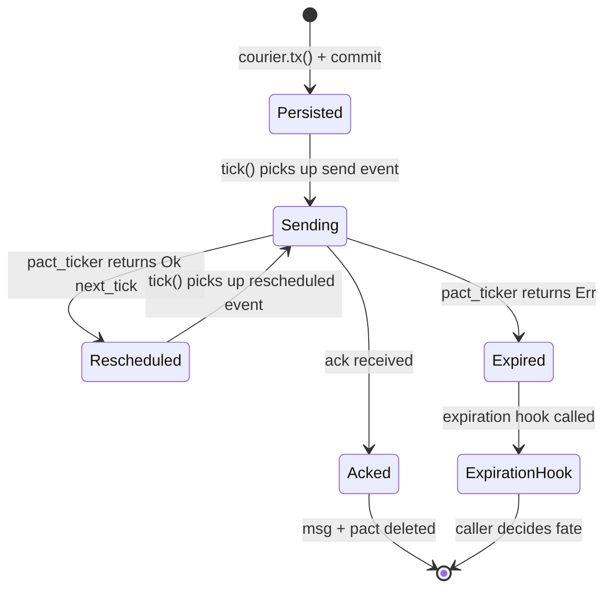
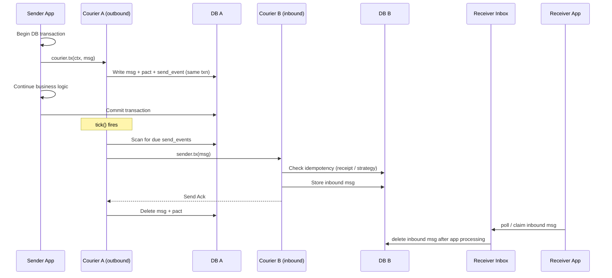
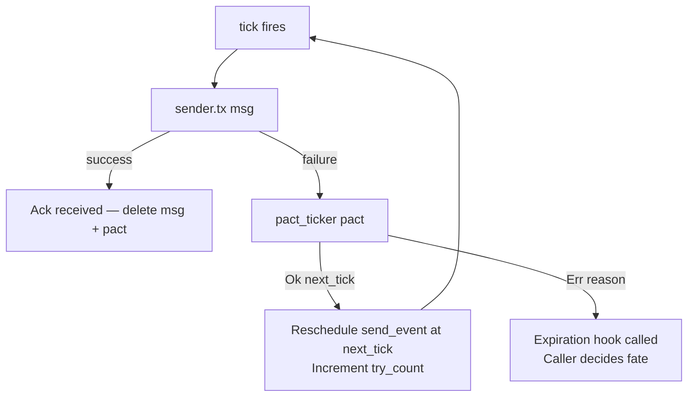
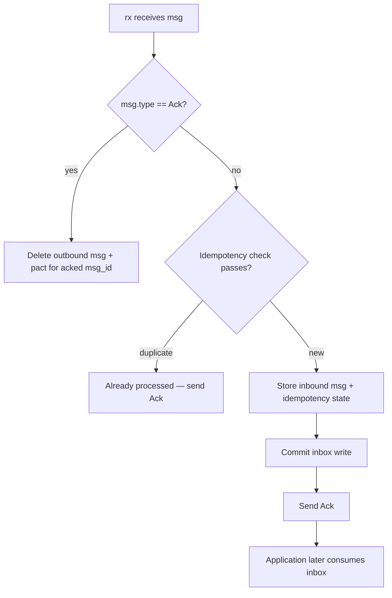
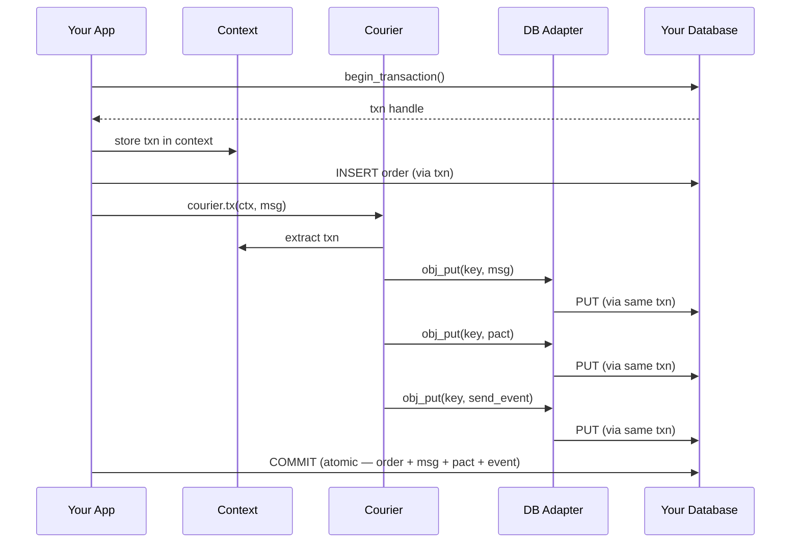

# trx Architecture

## What Is trx

`trx` means **transmit / receive**. It is a multi-language messaging component framework centered on a simple, canonical one-way API:

- `Msg`
- `Tx`
- `Rx`

That API makes the mechanics of delivery opaque to the caller. Concrete implementations can then provide different delivery mechanisms and different service guarantees.

The current repo contains:

- a **base message abstraction** in `rust/src/rustie/trx/`
- a **Rust reliable-delivery component** (`Courier`) layered on top of that abstraction
- fixture/interoperability scaffolding for future Go and TypeScript implementations

The durable implementation target is not this repo alone. Reusable library work should live in the shared language submodules:

- `rustie`
- `golangie` (to be created)
- `tscriptie` (to be created)

This repo is the coordination and verification repo for architecture, fixtures, e2e tests, and cross-language conformance.

The long-term goal is to unify one-way messaging semantics across transports and across languages.

Courier specifically is one higher-level framework in that stack. Its core idea is: **outbound messages are written transactionally alongside your application's business logic, then delivered asynchronously with configurable retry until acknowledged or expired.**

---

## Component Model

The intended architecture is layered:

1. **Base message API**
   - Standard message envelope (`Msg`)
   - Standard send/receive interfaces (`Tx`, `Rx`)
   - No built-in guarantee beyond “attempt to send/receive this message”

2. **Transport adapters**
   - Concrete `Tx` / `Rx` implementations over HTTP, WebSockets, gRPC, custom sockets, UDP, in-process dispatch, etc.
   - Responsible for bytes-on-the-wire and edge-specific concerns such as connection setup, framing, and transport-local authentication hooks

3. **Guarantee layers / messaging components**
   - Components that wrap or compose with the base `Tx` / `Rx` abstraction to provide stronger semantics
   - Example: Courier provides persistent outbox/inbox, ACK handling, retry, expiration, and dedup

This means `trx` is the product focus, not Courier. Courier is **not** the transport abstraction itself. Courier **uses** the transport abstraction.

### Design Intent

The caller should program against a stable messaging surface and avoid depending directly on low-level transport details. Swapping HTTP for WebSockets, or using in-process sync dispatch in tests, should not require the caller to change application message logic.

### Composition Direction

The likely direction is a composable chain, conceptually similar to HTTP middleware:

- envelope normalization
- edge authentication / connection validation
- message validation
- observability
- reliability guarantees (retry, ACK, persistence)
- routing / dispatch

This repo does not yet implement that full chainable model, but it is a coherent direction and consistent with the existing `Tx` / `Rx` abstraction.

### Standardization Boundary

The project should standardize the **one-way messaging API**:

- canonical `Msg`
- canonical `Tx`
- canonical `Rx`

Reliable messaging should **not** be forced into that same contract. Courier is a separate framework-layer API with its own message wrapper, state model, and options surface. It may expose synchronous waiting, ACK-aware operations, or framework-specific send options, but those are Courier concerns, not base `Tx` / `Rx` concerns.

### Specialization Boundary

`Msg` should remain the canonical outer envelope for one-way transmission. Message specialization should happen primarily through the **structure of `body`**, not by extending the outer envelope with framework-specific fields.

That choice keeps serialization simple across languages:

- Rust can deserialize `body` into concrete types
- Go can unmarshal `body` into concrete structs or maps
- TypeScript can narrow `body` with discriminated unions or runtime validation

In other words, specialization happens through the payload carried by `Msg.body`, while the outer envelope remains stable.

---

## Glossary

### Msg

`Msg` is the canonical one-way message envelope. It is the stable base contract for fire-and-forget messaging across transports and languages.

Fields: `id`, `version`, `from_id`, `to_ids`, `type_`, `body`.

The outer envelope should serialize cleanly across languages. `body` is moving toward a **binary / raw bytes** representation so the base `trx` contract does not force one structured payload model on every language/runtime.

- `version` is a small integer envelope version (`u16` / `uint16`) with default `1`.
- Courier is intentionally unordered (UDP-like). If an embedder needs ordering, it must define its own ordering fields and receiver-side ordered queueing.

`to_ids` is a list of intended recipients, but Courier sends the message exactly once per tick — it is the **transport layer's responsibility** to route the message to multiple recipients. `to_ids` is metadata for the transport, not a Courier-level fan-out mechanism.

The base `Msg` envelope is intentionally simple. More specialized behavior can be layered on top:

- body-specialized message protocols
- Courier-specific reliability wrappers
- wrapped payloads carrying application-defined metadata
- edge-authenticated envelopes that are normalized into trusted internal messages

### Msg.body

`body` is the primary specialization point.

The intended pattern is:

- outer `Msg` stays stable
- `type_` identifies how to interpret `body`
- `body` carries transport- and framework-specific payload bytes

This gives structural hierarchy that all target languages can support well.

Conceptually:

```text
Msg {
  id,
  from_id,
  to_ids,
  type_,
  version,
  body
}
```

Where `body` may represent:

- an application event payload
- a request payload
- a Courier protocol payload
- an auth-wrapped payload

The intended wire direction is:

- canonical `Msg.body` is binary / raw bytes
- frameworks and applications define their own codecs on top
- cross-language compatibility is achieved by agreeing on codecs, not by hardcoding a single structured payload type into the outer `Msg`

### CourierMsg

`CourierMsg` is a Courier-specific wrapper around canonical `Msg`. It exists because Courier's reliable delivery design benefits from keeping ACK and reliability-related metadata tightly bound to the message shape for storage and state-transition efficiency.

Conceptually:

```text
CourierMsg {
  msg: Msg,
  courier-specific reliability metadata,
  courier-specific ACK/correlation metadata
}
```

This wrapper is intentionally a **Courier snowflake**, not part of the universal `trx` base API.

Directionally, Courier-specific work should move toward a `reliable` package built on `trx`.

### Courier ACK Metadata

Courier uses ACK semantics as part of its reliable-delivery protocol. That metadata belongs to `CourierMsg`, Courier payload schemas, and Courier state, not to canonical `Msg`.

Courier ACK/correlation data may include:

- acknowledged message identity
- sender/recipient correlation for ACK validation
- version correlation
- recipient-progress state for multi-recipient completion

Some of this may live directly on `CourierMsg`, some may live inside Courier-specific `body` payloads, and some may live in Courier-managed storage keyed by message ID. That split is a Courier implementation decision.

### Pact

Retry state per outbound message: `tick_of_last_attempt: u64`, `try_count: u32`. Created by a caller-provided `pact_factory` at send time. A caller-provided `pact_ticker` function inspects the current Pact and decides when (or whether) to retry.

### Receipt

Inbound dedup record: `tick_acked_first: u64`, `tick_acked_last: u64`. Prevents duplicate processing of the same message. The receiver defines the dedup window as a number of ticks via `keep_receipt` — receipts are expired after that window elapses. This is intentionally variable: a receiver in a high-throughput environment might keep a short window, while one tolerating long-delayed retries might keep receipts for thousands of ticks.

Receipt expiry is a library feature, piggy-backed on `tick()`. During each `tick()` call, Courier scans for and deletes expired receipts.

**Note:** Receipts are the current idempotency mechanism but have a known limitation — see [Idempotency Strategy](#idempotency-strategy) below.

### Context

Go-style context with cancellation, deadlines, child hierarchy, and a typed value map. Used to thread the DB transaction through the call stack so that Courier's writes participate in the application's transaction.

### Tick

A Lamport-style logical timestamp. Courier does not own a clock or timer — the embedding application defines what a tick represents and advances it. This could be milliseconds, epoch seconds, block height, or any monotonically increasing value meaningful to the application.

This design makes Courier compatible with both **non-deterministic state machines** (wall-clock-driven services) and **deterministic state machines** (blockchain VMs, replicated logs, simulation engines) — the application controls time progression, and Courier simply schedules and evaluates send events against that timeline.

The application calls `courier.tick(n)` to process all send events due at tick ≤ n.

### Send Event

A lightweight marker (empty value) stored in the DB, indexed by tick. Represents "attempt to deliver this message at or after this tick." Created during `courier.tx()`, rescheduled by `pact_ticker` on retry.

---

## Goals

- Standardize a base message API across transports and languages.
- Make low-level delivery mechanics opaque to callers programming against `Tx` / `Rx`.
- Allow multiple transport implementations behind a common interface.
- Allow higher-level guarantee layers to be built on the same interface.
- Support multi-language implementations with compatible envelope semantics.
- In reliable-delivery frameworks such as Courier: provide crash-fault-tolerant, at-least-once delivery with a framework-specific API, message wrapper, payload schemas, pluggable storage, retry, and idempotency.

## Non-Goals (current)

- Global ordering guarantees (no total order across messages).
- Exactly-once delivery at the transport layer (idempotency is at the application/receiver layer).
- Built-in network transport (currently only `SyncTx` for in-process/test use).
- End-to-end auth forwarding in the base framework. Edge auth is expected to terminate at the boundary, after which internal sender IDs are trusted by convention or deployment design.
- Universal capacity model (deployment-specific sizing remains with operators).

## Design Tensions

The current goals are compatible, but several tensions must be handled explicitly:

1. **Base API vs guarantee-layer semantics**
   - The base `Tx` / `Rx` contract should stay minimal.
   - Reliability semantics such as ACKs, retries, durable inbox/outbox, and expiration belong in higher-level components like Courier.
   - Tension is resolved by keeping the base abstraction narrow and treating stronger guarantees as wrappers or composed components with their own APIs.

2. **Stable outer envelope vs specialized protocols**
   - The outer `Msg` envelope should remain stable across languages.
   - Specialized frameworks still need richer semantics.
   - Tension is resolved by specializing primarily through `body` shape and protocol-specific wrappers rather than by mutating the universal outer envelope.

3. **Opaque transport vs transport-specific features**
   - Callers want transport opacity.
   - Real transports expose different capabilities: headers, connection handshakes, MTU limits, streaming, ordering, backpressure, auth hooks.
   - Tension is resolved by standardizing only the common message contract and allowing adapters or wrappers to map transport-specific concerns at the edge.

4. **Trusted internal sender IDs vs authentication**
   - You want authentication handled at the edge, not forwarded through every internal hop.
   - That is coherent, but the trust boundary must be explicit: once a message is admitted into the internal pipeline, `from_id` is trusted because an edge component already validated it.
   - The risk is accidental widening of that trust boundary. This is an operational/design discipline issue, not an unresolvable architecture problem.

5. **Universal API vs different guarantee profiles**
   - Some implementations will be best-effort.
   - Others, like Courier, will provide durable at-least-once delivery.
   - Tension is resolved by documenting guarantee profiles per component instead of pretending the base API implies one fixed reliability model.

6. **Standardized one-way API vs non-standard reliable API**
   - Fire-and-forget messaging standardizes cleanly around `Msg` + `Tx` + `Rx`.
   - Reliable messaging likely needs framework-specific message shape, options, synchronous wait semantics, and ACK-specific operations.
   - Tension is resolved by standardizing the one-way API and explicitly allowing Courier to define a separate API around `CourierMsg`.

None of these tensions are fatal. They do mean the docs must clearly separate:

- the **base messaging abstraction**
- the **transport adapter layer**
- the **guarantee-providing component layer**

---

## Transport Abstraction

The base messaging framework is **transport-agnostic**. It defines `Tx` and `Rx` interfaces (traits in Rust, interfaces in Go/TypeScript) but has no opinion about how bytes move between services.

```
Tx   — transmits a message
Rx   — receives a message
```

This is a deliberate strength: implementers use whatever transport is available or optimal for their environment. The same higher-level messaging component can in principle run over HTTP, gRPC, WebSockets, Unix sockets, a shared-memory channel, or a custom protocol. The transport layer is a plug-in, not a dependency.

At the base `trx` layer, `Msg` is one-way and transport-neutral. Higher-level frameworks such as Courier/reliable may impose additional semantics on top.

| Strategy | Use Case |
|----------|----------|
| In-process direct dispatch (`SyncTx`) | Unit/integration testing without network |
| HTTP / gRPC | Production networked services |
| Channels / threads | In-process concurrency, actor systems |
| NATS / MQTT / AMQP | Event-driven or IoT environments |
| Custom wire protocol | Domain-specific or performance-optimized transports |
| Deterministic message passing | Blockchain / replicated state machine runtimes |

### Edge Authentication Model

Authentication is expected to happen **at the edge transport boundary**, not as a universal base-framework feature.

That means:

- HTTP may authenticate via headers, mTLS, cookies, or bearer tokens
- WebSockets may authenticate during connect/upgrade
- gRPC may authenticate via metadata or mTLS
- custom protocols may authenticate during session establishment

After edge admission, the message pipeline may operate on a normalized internal `Msg` whose `from_id` is treated as trusted. The proof of authentication does not need to be forwarded through the base framework.

If a deployment needs auth context to travel with the message, it can define a wrapped application-level payload or envelope extension that carries that metadata explicitly. That is an application/component choice, not a base-framework requirement.

### Courier Setup

To instantiate a Courier, the caller provides:

1. **`sender`** — a `Tx` implementation that performs the actual send.
2. **receiver-side consumption model** — in the current Rust implementation, Courier persists new inbound messages into an inbox (`rm:` keys) after dedup, and the embedding application consumes that inbox later. There is no inline handler callback in the current library surface.
3. **`pact_factory`** — creates the initial `Pact` when a message is sent (sets initial retry state).
4. **`pact_ticker`** — given current `Pact`, returns the next tick to retry or an error to stop retrying.
5. **`DB` implementation** — storage backend (see [Storage Abstraction](#storage-abstraction) below).
6. **`idempotency_strategy`** — receiver-side dedup strategy implementation (required; receipt strategy is one implementation).
7. **`recorder`** — observability recorder interface implementation (required; no-op implementation allowed).

### Courier API Surface

Courier should be treated as having its own API surface, distinct from the base `Tx` / `Rx` API.

That API may include:

- `CourierMsg` instead of bare `Msg`
- Courier-specific send options
- asynchronous send/receive operations
- optional synchronous waiting for ACK completion
- framework-specific error and expiration behavior

The key point is that Courier does not need to force all of this into the base `Tx` / `Rx` standard.

### Inbound Handling Model

There are currently two possible receiver architectures:

1. **Inline handler model** — Courier dedups, calls application code inline, and ACKs only after the handler succeeds.
2. **Durable inbox model** — Courier dedups, persists the inbound message, commits, and ACKs; application code consumes the stored inbox message later.

The current Rust implementation is the **durable inbox model**. The older parts of this document were written assuming the **inline handler model**, which is why some sections below still reference a `handler()`. For production planning, treat the durable inbox model as authoritative until an explicit architecture change is made.

## Base API vs Courier

The clean way to reason about the project is:

- `Msg` + `Tx` + `Rx` are the **standard messaging API**
- transport adapters are **implementations of that API**
- Courier is a **higher-level component** that composes with that API to provide reliable messaging guarantees using a Courier-specific `CourierMsg` wrapper and Courier-specific API semantics

Courier should therefore be documented as **one guarantee profile** in `trx`, not as the entirety of the framework.

## Shared Submodule Strategy

Reusable implementation work should flow into shared language submodules:

- `rustie`
- `golangie`
- `tscriptie`

Target migrations:

- create `golangie/trx`
- create `tscriptie/trx`
- move Courier-oriented code toward `reliable` packages built on top of those `trx` packages

This repository should retain:

- architecture docs
- migration planning
- shared fixtures
- conformance tests
- cross-language e2e and interoperability tests

---

## Message Lifecycle

### Outbound Message State Machine



### Happy Path



### Failure / Retry Path



### Inbound Receive Path



### Failure Mode Catalog

| Failure | Point of Crash | Recovery Behavior | Data Risk |
|---------|---------------|-------------------|-----------|
| Sender crash after `tx()`, before commit | Between `courier.tx()` and DB commit | Transaction rolls back — message never existed | None |
| Sender crash after commit, before `tick()` | After commit, `tick()` not yet called | On restart, `tick()` picks up persisted send event | None — core durability guarantee |
| Sender crash during `tick()`, after send, before ack | `sender.tx()` succeeded, ack not processed | On restart, send event still exists, message retries. Receiver dedup via idempotency. | Duplicate delivery (handled by idempotency) |
| Receiver crash after inbox commit, before ack sent | Inbound msg + idempotency state committed, ack not sent | Sender retries. Receiver dedup suppresses duplicate, then another ack is sent. | None if dedup window covers retry horizon |
| Receiver app crash after ack, before inbox consumption | Courier already acked sender; app has not yet processed persisted inbox entry | App restarts and later drains inbox. Sender does not retry because ack already succeeded. | Processing latency increases; no sender-side retry safety needed |
| Network partition (ack lost) | Ack in flight | Sender retries on next tick. Receiver dedup via idempotency. | None if idempotency window covers retry horizon |
| DB full / write failure during `tick()` | Pact update or send event reschedule | `tick()` operates in its own DB transaction — partial writes roll back | None if tick transaction is atomic (see [Tick Atomicity](#tick-atomicity)) |
| `courier.tx()` fails mid-write | Partial Courier state in caller's txn | `courier.tx()` returns error. **Caller must roll back the transaction.** Partial state is discarded with the rollback. | None if caller rolls back. Corruption if caller commits partial state. |

---

## Storage Abstraction

### The Problem Courier Solves

Consider a typical service that processes an order and then sends a notification:

```
1. BEGIN database transaction
2. INSERT order into orders table
3. COMMIT transaction
4. Send "order_created" message to notification service   ← what if this fails?
```

If step 4 fails (network blip, crash, OOM), the order exists but no notification was sent. The system is in an inconsistent state and nobody knows. Reversing the order (send first, then write) means a crash between 3 and 4 produces a notification for an order that doesn't exist.

This is the **dual-write problem**: writing to two independent systems (your database and a message broker) cannot be made atomic without coordination.

### Courier's Solution: Outbox Pattern with Shared Transactions

Courier eliminates the dual-write problem by persisting the outbound message **inside the same database transaction** as your application state. The message and your business data commit together or roll back together — atomically.

```
1. BEGIN database transaction
2. INSERT order into orders table
3. courier.tx(msg)              ← writes msg + pact + send_event into the SAME transaction
4. COMMIT transaction           ← order AND message are persisted atomically
   ... later ...
5. courier.tick()               ← scans for due messages, delivers them asynchronously
```

If the transaction commits, the message **will** be delivered (Courier retries until ack or expiry). If the transaction rolls back, the message **never existed**. There is no window where one is visible without the other.

### The DB Adapter and Transaction Context

Courier does not bring its own database. Instead, **you provide a DB adapter that wraps whatever storage your application already uses**. Courier's persistence operations — writing the message, the pact, the send event — execute against this adapter, which delegates to your underlying storage engine.

The key mechanism is **transaction context sharing**. When your application begins a database transaction, it places that transaction handle into a `Context` object. When you call `courier.tx(ctx, msg)`, Courier extracts the transaction from the context and uses it for its own writes. Courier's writes and your application's writes go through the **same transaction handle**, so the underlying database engine treats them as a single atomic unit.



### Error Contract for `courier.tx()`

If `courier.tx()` fails (DB adapter error, serialization failure, etc.), it returns an error. **The caller must roll back the entire transaction.** Courier does not own the transaction and cannot roll it back — the caller created it and the caller is responsible for its fate.

If the caller commits a transaction that contains partial Courier state (e.g., message written but pact or send event not), the system enters an inconsistent state. Treat a `courier.tx()` error the same as any other write failure in your transaction: roll back.

### DB / DBTx Interface

The DB adapter is an interface you implement. It maps Courier's operations to your storage engine's API:

```
DB      — open/close lifecycle, begin transaction
DBTx    — transactional operations:
           obj_put / obj_get / obj_del    (key-value CRUD)
           tail_push / tail_pop           (queue-like, append end)
           head_push / head_pop           (queue-like, front end)
           seq_get                        (prefix scan, ordered iteration)
           commit / cancel
```

Because **you** control this mapping, Courier can sit on top of:

- **An embedded KV store** (Sled, Redb, RocksDB, SQLite) — for single-process services
- **A distributed KV store** (TiKV, FoundationDB, CockroachDB) — for distributed services
- **A relational database** (Postgres, MySQL) — Courier keys in a dedicated table alongside your application tables
- **A document database** (MongoDB) — Courier keys in a dedicated collection within the same session
- **Whatever your application already uses** — the point is to avoid adding a second storage system

The only requirement is that the storage engine supports transactions, because the entire value proposition depends on Courier's writes participating in your application's transaction.

### Tick Atomicity

`tick()` performs multiple DB operations per message (delete old send event, update pact, write new send event or delete on ack/expiry). These operations must be atomic — a crash between them could double-fire or lose a message.

`tick()` operates in its own DB transaction, separate from any caller transaction. The full sequence for a single `tick(n)` call:

1. Begin transaction
2. Scan `te:` prefix for all send events due at tick ≤ n
3. For each due event: attempt send, process result (ack/reschedule/expire), update DB state
4. Scan for and delete expired receipts
5. Commit transaction

If the commit fails, all state changes from this tick are rolled back and can be retried on the next `tick()` call.

The current Rust implementation expects the caller to provide the DB transaction to `tick()`. The required invariant is still the same: all DB mutations performed during a `tick()` call must commit or roll back atomically.

### Why This Matters

| Without Courier | With Courier |
|---|---|
| Two systems (app DB + message broker) | One system (app DB) |
| Dual-write problem: crash between DB commit and broker publish = lost messages | No dual-write: message persists atomically with business data |
| Requires distributed transactions (2PC) or eventual consistency hacks (CDC, polling) to coordinate | No coordination needed — it's one transaction |
| Message broker is a separate infrastructure dependency to operate | No additional infrastructure |
| Retry logic is broker-specific | Retry logic is yours (pact_factory + pact_ticker) |

---

## DB Key Namespace

All keys are prefixed with a configurable `{prefix}` to allow multiple Courier instances on the same DB.

| Key Pattern | Contents | Purpose |
|---|---|---|
| `{prefix}:tm:{msg_id}` | Outbound Msg (JSON) | Message awaiting delivery |
| `{prefix}:tp:{msg_id}` | Pact (JSON) | Retry state for the message |
| `{prefix}:te:{tick}:{msg_id}` | Empty | Send event — tick-indexed for scanning |
| `{prefix}:rm:{msg_id}` | Inbound Msg (JSON) | Message received, pending processing |
| `{prefix}:rr:{msg_id}` | Receipt (JSON) | Dedup record for processed messages |

The `te:` keyspace is the tick-indexed send queue. `tick(n)` does a prefix scan on `{prefix}:te:` up to the current tick to find due events.

---

## Idempotency Strategy

### Current: Receipt-Based Dedup

The current implementation uses persistent receipts with a tick-based expiry window. This works but has a known limitation: if a retry arrives after the receipt expires, the message is re-processed. The dedup window (`keep_receipt`) must be longer than the maximum retry horizon (`pact_ticker`'s longest retry schedule), or the application must accept potential re-processing.

### Pluggable Idempotency (Required)

Idempotency is a required pluggable receiver-side strategy. Receipt-based dedup is the first built-in strategy, but not the only contract. Supported strategy types:

| Strategy | Mechanism | Tradeoffs |
|----------|-----------|-----------|
| **Persistent receipts** (built-in) | Store receipt per message, expire after N ticks | Simple. Requires cleanup. Finite dedup window. |
| **Monotonic sequence numbers** | Per-sender high-water mark. Receiver rejects any `seq ≤ hwm`. | No expiry, no accumulation. Requires ordered delivery per sender or gap tolerance. |
| **Content-addressed** | Message ID derived from content hash. Receiver tracks seen hashes. | No ID collisions. Still needs a window for the hash set. |
| **Custom** | Caller-provided idempotency check function. | Maximum flexibility. Caller owns the contract. |

`keep_receipt` becomes strategy-specific configuration under `idempotency_strategy`. Cleanup remains strategy-defined: receipt-based strategies may clean on `tick()`, while sequence-based strategies may not require cleanup.

Current Rust strategy contract:

- `on_rx(msg, tick)` — classify `new` vs `duplicate` and persist dedup state in the receive transaction.
- `on_tick(tick)` — strategy-specific cleanup or maintenance, such as expiring receipts.

If Courier later adopts an inline handler model, the idempotency contract will likely need to expand to a `begin/commit/abort` shape so dedup state can be tied to handler success rather than inbox persistence.

---

## Expiration Hook

When `pact_ticker` returns an error (retry budget exhausted, deadline exceeded, etc.), the message has **expired**. Courier should expose a caller-provided **expiration hook** that receives the expired message and pact. The caller decides the message's fate:

- Log and discard
- Move to a dead-letter queue
- Alert / escalate
- Retry with a different policy
- Persist for later inspection

This keeps Courier lean — it defines the expiration event, the application defines the response.

---

## Observability Recorder

Courier emits observability signals through a caller-provided recorder interface. Courier does not hardcode metrics/tracing vendors.

Required event surface (stable names):

- `courier.tx.persisted`
- `courier.tick.start`
- `courier.tick.send_attempt`
- `courier.tick.send_success`
- `courier.tick.send_failure`
- `courier.rx.duplicate`
- `courier.rx.persisted`
- `courier.ack.processed`
- `courier.msg.expired`

Note: the current Rust code still emits `courier.rx.handler_success` when it persists an inbound message into the inbox. That event should be renamed to `courier.rx.persisted` to match the actual architecture.

Recorder contract guidelines:

- Non-blocking: recorder failures must not fail Courier message processing paths.
- Low allocation in hot paths (`tick`, `rx`).
- Correlation IDs propagated from message metadata when present.
- Event payload baseline includes retry/latency fields (`try_count`, `scheduled_tick`, `now_tick`, and elapsed duration where available).
- Avoid per-event wall-clock syscalls in hot paths; prefer injected clocks and monotonic elapsed timing.
- Implementers map events to metrics/logs/traces in their own stack.

---

## Message Versioning

Courier supports message versioning with minimal overhead via the `Msg.version` envelope field.

- Default is `version = 1` when omitted by older producers.
- Receivers must ignore unknown optional fields to preserve forward compatibility.
- Breaking envelope changes increment `version`.
- Compatibility window is deployment-configurable (not fixed to `N`/`N+1`).
- Payload (`body`) schema versioning is application-defined; Courier treats `body` as opaque.

---

## Captured Decisions

- Observability payload baseline is option B, with retry/latency fields and monotonic/injected timing (avoid hot-path wall-clock calls).
- ACK validation requires correlation fields and malformed ACK rejection.
- Message version evolution uses configurable compatibility windows (strategy B).
- Runbooks will be split by incident class under `doc/runbooks/` (strategy B).
- Multi-recipient ACK progress uses recipient-list shrinking: on validated ACK, remove the acking `to_id` from the message's target recipient IDs so future retries skip that recipient.
- ACK timeout/retry for partial success uses one shared pact per message (Option A) to avoid per-recipient write amplification.
- Current inbound architecture is durable inbox, not inline handler execution. Any move to inline handling is a separate design change, not current behavior.

---

## Invariants

- A message is only visible to `tick()` after the caller commits its DB transaction.
- Idempotency check runs before inbox persistence — duplicate messages are acked but not persisted again (within the idempotency window).
- `tick()` is intentionally single-threaded per Courier instance and must not be called concurrently. The caller is responsible for serializing `tick()` calls (e.g., single-threaded tick loop, mutex).
- `tick()` must run within one DB transaction per invocation — pact updates and send event rescheduling are atomic.
- ACK processing updates sender state; outbound msg+pact are deleted only when delivery is complete for the message's required recipient set.
- At most **one send attempt per message per tick**. Courier does not retry within a single tick.
- If `courier.tx()` returns an error, the caller must roll back the transaction.
- For new inbound messages, Courier commits the inbox write before sending the ACK.

## Non-Guarantees

- No ordering guarantees across messages (tick-based scanning is best-effort temporal order).
- Courier does not provide ordered delivery semantics. Embedders that require order must implement sender metadata + receiver queue discipline.
- Idempotency is bounded by the receiver's strategy. Receipt-based dedup has a finite window; messages replayed after expiry may be re-processed.
- The underlying transport may introduce its own retry mechanism (e.g., HTTP client retries, TCP reconnects), which is transparent to Courier. Layered transport retries are not recommended as they can interact unpredictably with Courier's own retry scheduling.
- Retry strategy is controlled entirely by the caller's policy functions (`pact_factory` and `pact_ticker`), not by Courier itself.

---

## Usage Warnings

### Embedder-Managed Ordering Pattern

Courier does not enforce ordering. If you need per-entity order, carry ordering metadata in `Msg.body` (or app-level headers) and enforce order at the receiver.

Recommended per-key model:

1. Sender includes `(stream_id, seq)` where `seq` is monotonic per `stream_id`.
2. Receiver keeps `last_applied_seq[stream_id]`.
3. Receiver accepts only `seq == last_applied_seq + 1`.
4. Receiver buffers future messages (`seq > last_applied_seq + 1`) with TTL/size bounds.
5. Receiver drops duplicates/stale messages (`seq <= last_applied_seq`) and still ACKs them.

Example envelope payload (app-defined):

```json
{
  "stream_id": "acct:1234",
  "seq": 42,
  "event": "debit_applied",
  "amount": 100
}
```

Receiver pseudocode:

```text
if seq <= last_applied_seq(stream_id):
    ack + drop (duplicate/stale)
elif seq == last_applied_seq(stream_id) + 1:
    apply + advance watermark + drain contiguous buffered items
else:
    buffer with bounds (max_gap, max_items, ttl)
```

Operational guardrails:

- Bound buffer memory (`max_items_per_stream`, global cap).
- Expire long gaps to DLQ for operator review.
- Keep idempotency horizon larger than worst-case reorder + retry horizon.
- Use per-stream locks or single-threaded executors to avoid watermark races.

### Tick Advancement and Burst

It is valid for the embedding application to call `tick(10)` and then `tick(1000)`. If ticks represent real-time milliseconds, this happens naturally (e.g., the app was busy for a second). All messages due in ticks 0–1000 will fire in that single `tick(1000)` call.

This is by design, but be aware of the burst implications:

- A large tick gap means all messages scheduled in that window fire in one call.
- If the application needs to bound per-call work, advance ticks incrementally.
- There is no built-in batch limit on `tick()` — all due messages are processed.

### Deterministic State Machine Constraints

The Lamport time model makes Courier compatible with deterministic state machines, but **only if all inputs to Courier are deterministic**:

- `pact_factory` must not use wall-clock time, randomness, or external state.
- `pact_ticker` must be a pure function of the pact state.
- `Msg.id` must be generated deterministically (e.g., derived from content hash, not UUID).
- The transport layer must deliver messages in a deterministic order, or the application must tolerate non-deterministic delivery order.

If any of these conditions are violated, replaying the same sequence of ticks produces different behavior. When using Courier in a deterministic context, treat these as hard requirements, not guidelines.

### Idempotency Window vs. Retry Horizon

When using receipt-based dedup, the dedup window (`keep_receipt` in ticks) must be longer than the maximum retry horizon (the longest `pact_ticker` will keep retrying). If the window is shorter, a late retry can arrive after the receipt has expired and the message will be re-processed.

System designers must size these parameters to satisfy their SLAs. Courier provides the mechanism — the policy is yours.

---

## Implementation Status

| Component | Rust | Go | TypeScript |
|-----------|------|----|------------|
| Msg / Pact / Receipt model | Implemented | Fixture/scaffold only | Fixture/scaffold only |
| Courier core (`tx` / `tick` / `rx`) | Implemented | Not implemented | Not implemented |
| DB abstraction | Implemented (`DB` / `DBTx`) | Not implemented | Not implemented |
| Storage backend | `SledDB` only; not a production-grade transactional adapter | Not implemented | Not implemented |
| Transport | `SyncTx` only for in-process tests | Interop binary only | Interop binary only |
| Inbound model | Durable inbox persistence + ACK | Not implemented | Not implemented |
| Idempotency strategy | Receipt built-in + pluggable interface | Fixture parity only | Fixture parity only |
| Expiration hook | Implemented (no-op + DLQ reference hook) | Not implemented | Not implemented |
| Observability recorder interface | Implemented, event surface needs naming cleanup | Not implemented | Not implemented |
| Conformance suite | Fixture + interop coverage | Fixture + interop coverage | Fixture + interop coverage |

---

## Rust Implementation

### Crate Structure

```
rust/src/
├── lib.rs                  Crate root, re-exports
├── courier.rs              Courier struct + DAO (tx, tick, rx logic)
├── context.rs              Go-style Context (cancel, deadline, values)
├── db.rs                   DB / DBTx trait definitions
├── db_sled.rs              SledDB backend
├── pact.rs                 Pact struct (retry state)
├── receipt.rs              Receipt struct (dedup record)
├── lib_tests.rs            Unit tests (serde round-trips)
├── context_tests.rs        Context tests
├── db_sled_tests.rs        SledDB tests
└── rustie/                 Submodule (shared infra, see below)

rust/tests/
├── courier_tests.rs        Integration tests (tx→tick→rx, durability)
└── math_suite_tests.rs     Scaffold
```

### Tx / Rx Traits (Rust)

```rust
#[async_trait]
pub trait Tx: Send + Sync {
    async fn tx(&self, ctx: &Context, msg: &Msg) -> Result<(), String>;
}

#[async_trait]
pub trait Rx: Send + Sync {
    async fn rx(&self, ctx: &Context, msg: &Msg) -> Result<(), String>;
}
```

`SyncTx` is the current in-process implementation — routes `tx()` directly to `Rx::rx()`. Used for testing. No production network transport ships in this repo today.

### DB Adapter Example (Rust / Sled)

```rust
// Application creates the transaction and shares it with Courier via Context
let ctx = Context::background();
let db = SledDB::new("./my_app.db");
let dbtx = db.begin();

// Store the transaction in the context — Courier will extract it later
let ctx = dbtx_to_ctx(&ctx, dbtx);

// Your business logic: write an order
dbtx_from_ctx(&ctx).obj_put("orders:12345", &order)?;

// Courier writes the outbound message into the SAME transaction
courier.tx(&ctx, &Msg {
    id: "msg-001".into(),
    from_id: "order-service".into(),
    to_ids: vec!["notification-service".into()],
    type_: "order_created".into(),
    body: serde_json::to_string(&order)?,
})?;

// One commit. Order + message + pact + send_event all persist atomically.
dbtx_from_ctx(&ctx).commit()?;
```

### Available Storage Backends (Rust)

| Backend | Module | Notes |
|---------|--------|-------|
| SledDB | `db_sled.rs` | Embedded KV. Used in integration tests. `tail_push`/`head_push` are naive single-key writes (not real queue semantics). |
| Redb | `rustie/db/kv_redb.rs` | Embedded ACID KV. Configurable durability (Immediate / None). |
| TiKV | `rustie/db/kv_tikv.rs` | Distributed KV with optimistic transactions. Requires live cluster. |
| BucketedRawKvStore | `rustie/db/kv_store_bucketed.rs` | Sharding wrapper. 1-byte bucket prefix with streaming heap-merge for sorted iteration. |

Courier's `DB`/`DBTx` traits are intentionally leaner and more specific than rustie's general-purpose `RawKvStore`/`RawKvTxn`. The rustie traits are a low-level, async, raw-bytes KV abstraction; Courier's traits are a higher-level surface tailored to the operations Courier actually needs (typed objects, prefix scans, queue-like ops). Courier's `DB`/`DBTx` should layer cleanly over a `RawKvStore`/`RawKvTxn` implementation — a thin adapter that serializes and delegates.

### Rustie Submodule

The `rust/src/rustie/` directory is a git submodule containing reusable infrastructure:

- **db/** — KV store abstractions (RawKvStore/RawKvTxn), Redb, TiKV, bucketed sharding
- **msg/** — Msg struct, Tx/Rx traits, SyncTx
- **cam/**, **mic/**, **img/** — media capture (camera, microphone, JPEG)
- **http/** — HTTP utilities
- **sensor/** — sensor drivers (pH)
- **time_series/** — time-series storage (mem, disk, buffered)

The cam/mic/img/sensor/time_series modules are IoT/edge infrastructure — not part of courier's messaging core, but co-published in the crate.

---

## Go Implementation

### Module Structure

```
golang/
├── src/
│   ├── go.mod              github.com/jkassis/courier (Go 1.23.1)
│   ├── cmd/main.go         Stub binary
│   └── pkg/
│       ├── add.go          Scaffold
│       └── add_test.go     Scaffold
└── tests/
    ├── go.mod
    └── math_test.go        Scaffold
```

**Status:** Scaffold only — no courier messaging logic yet.

### DB Adapter Example (Go / Postgres, hypothetical)

```go
// Application shares its *sql.Tx with Courier via context
tx, _ := db.BeginTx(ctx, nil)

// Your business logic
tx.ExecContext(ctx, "INSERT INTO orders (id, total) VALUES ($1, $2)", orderID, total)

// Courier's DB adapter wraps the same *sql.Tx
// When courier.Tx() calls adapter.ObjPut(), the adapter does:
//   tx.ExecContext(ctx, "INSERT INTO courier_outbox (key, value) VALUES ($1, $2)", ...)
courierCtx := courier.WithDBTx(ctx, tx)
courier.Tx(courierCtx, &msg.Msg{
    ID:     "msg-001",
    FromID: "order-service",
    ToIDs:  []string{"notification-service"},
    Type:   "order_created",
    Body:   orderJSON,
})

// One commit. Both the order row and the courier_outbox row committed atomically.
tx.Commit()
```

---

## TypeScript Implementation

### Module Structure

```
typescript/
├── package.json            Node 20, TypeScript 5.6, mocha + jest
├── tsconfig.json
├── src/
│   ├── cmd/main.ts         Stub binary
│   ├── internal/main.ts    Scaffold
│   └── pkg/
│       ├── math.ts         Scaffold
│       ├── math.test.ts    Scaffold
│       └── utils.ts        Scaffold
└── tests/
    └── main.test.ts        Scaffold
```

**Status:** Scaffold only — no courier messaging logic yet.

### DB Adapter Example (TypeScript / MongoDB, hypothetical)

```typescript
// Application shares its MongoDB session with Courier via context
const session = client.startSession();
session.startTransaction();

// Your business logic
await db.collection("orders").insertOne(order, { session });

// Courier's DB adapter wraps the same MongoDB session
// When courier.tx() calls adapter.objPut(), the adapter does:
//   db.collection("courier_outbox").insertOne({ key, value }, { session })
const ctx = courier.withDBTx(context, session);
await courier.tx(ctx, {
    id: "msg-001",
    fromId: "order-service",
    toIds: ["notification-service"],
    type: "order_created",
    body: JSON.stringify(order),
});

// One commit. Order document + courier outbox document committed atomically.
await session.commitTransaction();
```

---

## TODO and Decision Queue

Implementation TODOs and decision-required open questions are tracked in [TODO.md](TODO.md).
